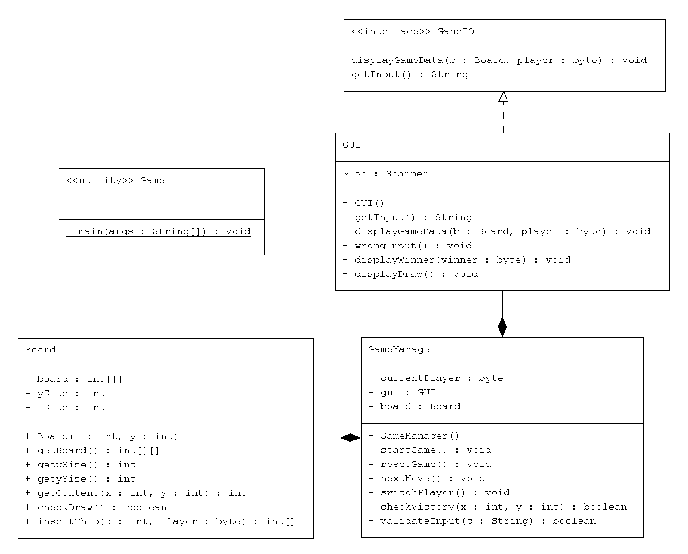

# Viergewinnt

Play Viergewinnt, a popular two player minigame.

## How to launch

- Clone the repo and open the project in IntelliJ IDE
- To start the game, run main method of "Game" class

## Class structure

